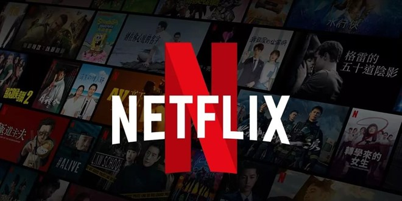

# EDA-on-Netflix-Movies-and-TV-Shows

Netflix is a leading player in streaming media with over 200 million global subscribers. Its transformation from DVD rental service to media publisher through its Netflix Originals program has made it a dominant player in the industry.

# About the data

### Records:

1. SHOW-ID - Unique id of each show (not much of a use for us in this project)
2. TYPE - The category of a show, can be either a Movie or a TV Show
3. TITLE - Name of the show
4. DIRECTOR - Name of the director(s) of the show
5. CAST - Name of the show
6. COUNTRY - Name of countries the show is available to watch on Netflix
7. DATE ADDED - Date when the show was added on Netflix
8. RATING - Show rating on netflix
9. RELEASE YEAR - Release year of the show
10. DURATION - Time duration of the show
11. LISTED IN - Genre of the show

# Content
0. **ABOUT THE DATA**

1. **IMPORTING LIBRARIES**

2. **DATA DESCRIPTION AND DATA CLEANING**

    1. Import data

    2. Data types

    3. Missing values
    
        
        
    4. Duplicates

3. **DATA ANALYSIS**

    1. How content is distributed ?  
        

    2. WHAT ARE THE COUNTRIES WITH HIGHEST NUMBER OF MOVIES & TV-SHOWS ?  
        
    
    3. what is the content added in each year ?  
        

    4. what are the ratio of the genres ?  
        

4. **RECOMMENDATION SYSTEM**
        The output of the recommendation system shows the top 10 movies or TV shows that are most similar to the input title based on their similarity score calculated         using cosine similarity. Here are some insights you can gather from the output:
        
        1. Genre similarity: The recommended movies and TV shows may share the same or similar genre as the input title. For example, Ocean's Eleven and Head Count are            both in the crime genre, while Girlfriend's Day and Frank & Lola are in the romance genre.
       
        
        2. Actor similarity: Some of the recommended movies and TV shows may feature the same actors or actresses as the input title. For example, Ocean's Eleven an              The Trust both star Nicolas Cage.
        
        3. Theme or plot similarity: The recommended movies and TV shows may have similar themes or plots as the input title. For example, Fear and Loathing in Las                Vegas and Girlfriend's Day both explore the theme of relationships and self-discovery.

6. **CONCLUSIONS AND INSIGHTS**

